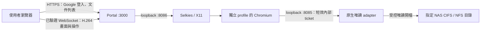

# Unraid Selkies 唯讀 OpenPencil

一般 CI／GHCR 映像同時包含 raster viewer、Selkies 與 Chromium，使用既有 `latest`、`sha-*`、branch／version 標籤即可；由設定 `viewerMode: "selkies"` 選擇遠端唯讀模式，無需 Selkies 專用映像標籤。現有 raster viewer 仍可用獨立設定／部署，也可保留舊映像 digest 回復。身份採已接受的 Google Workspace `google-mount`：合格組織帳號共用設定的唯讀目錄。這不代表 DSM 個人 ACL 已完成；`dsm-strict` 的 fail closed 行為保留。

## 交付與固定版本

一般 CI 與手動建置共用 [deploy/Dockerfile](../deploy/Dockerfile)，舊 `deploy/selkies/Dockerfile` 路徑只是同一檔案的連結。版本鎖為 [versions.json](../deploy/selkies/versions.json)。支援 `linux/amd64`／`linux/arm64`；本案 Unraid 使用 amd64。

| 元件 | 固定值 |
|---|---|
| LinuxServer Chromium 元件 index | `lscr.io/linuxserver/chromium@sha256:2d32e1b2b28aa92973aa0f58c433c0b045db6e1224d7001eeaa9cde1a474ce13` |
| amd64 元件 manifest | `sha256:35e67a28573b13269bb96f9e8464411b4b71467ce46a055a4d584ab5d2c0f06f` |
| arm64 元件 manifest | `sha256:30282ed89be588e4ff891a32c88f88876e697126494d0d745693a064c7210807` |
| LinuxServer build | `d759a0f5-ls56` |
| Chromium | `154.0.8037.57-1~deb13u1` |
| Mesa | `25.0.7-2+deb13u1` |
| Selkies / pixelflux | `2.0.0` / `2.1.0` |
| Node / Bun | `22.23.3` / `1.4.2` |
| OpenPencil | pristine `8c72b62da07ea1f7e82de84c7c837c3c78dfbf95`，v0.15.1 |
| runtime 額外 Debian 套件 | snapshot `20260930T000000Z`；映像內 `/app/runtime-packages.txt` |

在 repository 根目錄建置：

```sh
docker build --platform linux/amd64 -f deploy/Dockerfile \
  -t openpencil-viewer:0.1.0 .
docker image inspect openpencil-viewer:0.1.0 \
  --format '{{.Id}} {{.Architecture}} {{json .Config.User}}'
docker save -o openpencil-selkies-amd64.tar openpencil-viewer:0.1.0
sha256sum openpencil-selkies-amd64.tar
```

Dockerfile 使用 LSIO 映像作為元件來源，覆寫 entrypoint，以 `10001:10001` 啟動 Portal；不啟動其 root `/init`、nginx、終端、Docker daemon 或預設 Chromium wrapper。Node runtime 依 TARGETPLATFORM 取得，避免 ARM 建置主機將 ARM Node 放進 amd64 映像。建置 context 排除 `test_files/`、OAuth、state、`.work/`、原始 upstream checkout；建置時取得並驗證固定 upstream。

`npm run release:export:selkies` 可匯出映像及公開部署檔到 `.work/releases/selkies-amd64-<image id>/`，附 manifest、SHA256SUMS、版本鎖與實際驗證狀態，不包含FIG、OAuth或state。匯出的Dockerfile是來源參考，重建仍需repository完整來源；解壓後可直接按本手冊手動部署。

收到匯出目錄時，在其根目錄先執行 `sha256sum -c SHA256SUMS` 與 `docker load -i image.tar`，再進入 `deploy/selkies/` 填寫 `.env`／config並執行Compose；後文的 `openpencil-selkies-amd64.tar` 是自行建置匯出的示例檔名。

此次 CI 修改發布成功後，Unraid GUI 的 Repository 直接填 `ghcr.io/macacagames/openpencil-viewer:latest`，或一般 `sha-<新commit>`／已驗證 digest。舊 `sha-4d2baff` 的建置未包含 Selkies runtime，需使用此次修改之後發布的新映像。CI 在兩種架構的原生 Linux runner 上先驗證 raster／唯讀來源、實際 CPU H.264、resize、會話隔離與登出清理，再發布同一已測映像；UID10001 和 Unraid UID99 均納入。這些合成測試不代替 Unraid GPU／正式 NAS 驗收。離線 tar 匯入仍可選用，並在 `.env` 的 `PORTAL_IMAGE` 填入匯入後的本機 tag。

## 資料與連線邊界



外部 `/scene`、`/content` 繼續回應 410。內部文件路由只存在另一個 loopback listener；公開 listener 的 `/_remote/*`、`/remote-desktop` 回應 404。內部 ticket 與活動會話、Portal session、文件 revision 綁定，讀取前後重新驗證。不能把 8085、8086 發布到主機或代理。

外部瀏覽器使用官方 Selkies core 解碼 H.264；不解析 FIG、不接收 scene、不建立 OpenPencil 文件 graph。原生 UI 在伺服器 Chromium 内運作，切頁、縮放與平移使用保留的 renderer、圖片與字體狀態。內部 scene cache 有 64MiB 上限，超過上限的文件在重新建立會話時可能重新解析；現有原生圖片 cache 上限沿用 adapter，不是整個程序或 VRAM 上限。

## 部署參數與手動步驟

尚未取得實際 Unraid 版本、GPU PCI ID、share／本機儲存路徑；範例故意留白。使用操作員已核准的指定 share／子目錄，不掛載整個 NAS volume。NAS 掛載由操作員在 Unraid 管理，不由應用程式建立或改動。對 NAS 的 mount 與容器 bind 都應唯讀。

1. 把 `deploy/selkies/` 放到獨立的部署目錄；保留原 raster 部署。複製 `env.example` 為 `.env`，`config.example.json` 為專用 config 目錄中的 `config.json`。改 `origin`、`allowedHostedDomains`，沿用既有 OAuth JSON；callback 為 `https://你的網域/auth/google/callback`。
2. `.env` 填入 `PORTAL_CONFIG_DIR`、`GOOGLE_OAUTH_FILE`、`NAS_DESIGNS_PATH`、`LOCAL_STATE_PATH`。Unraid Compose 預設 `PORTAL_UID=99`／`PORTAL_GID=100`，可依需求設為10001:10001；state/profile 必須使用 Unraid 本機獨立儲存，既有資料需屬於選定 UID，config／OAuth／NAS 資料只需可讀。不要用 `chmod 777` 解決權限。
3. `NAS_EXPECTED_SOURCE` 填入容器 `/proc/self/mountinfo` 顯示的實際來源，例如 `//NAS/approved-share` 或 `NAS:/approved-export`；不是 Unraid 本機 mountpoint。啟動要求 `/data/designs` 是 `ro` 的 `cifs`、`nfs` 或 `nfs4` 且來源完全相符；每次建立／續期／存取串流及 watchdog 都會重新檢查。來源 inode、revision、可讀性另由既有安全 index 驗證。
4. 匯入映像並先用 CPU／軟體渲染跑通登入與會話：`.env` 設 `GPU_ENCODER_MODE=cpu`、`GPU_RENDER_MODE=software`，使用主 Compose。主 Compose 不需要 DRM device。若使用 `auto` 且未提供 GPU，日誌明確顯示 CPU／software。
5. 反向代理參考 `nginx.example.conf`；TLS、Origin、WebSocket Upgrade、長連線 timeout 均需成立。範例只 listen 主機 `127.0.0.1:24681`，代理需在同主機可達此位址。若代理另在容器，操作員須設計專用網路／對應 listener，不能將內部端點一起公開。
6. 開始 GPU 診斷，填入精確 PCI 地址、DRM group 數值 GID，再加入 GPU overlay。正式手動部署命令如下：

```sh
docker compose --env-file .env -f compose.unraid.yml config
docker compose --env-file .env -f compose.unraid.yml pull
docker compose --env-file .env -f compose.unraid.yml up -d
docker compose -f compose.unraid.yml logs --tail 100 portal
# GPU 模式：設定 GID／PCI 與模式後重建；不要同時跑兩個部署爭用代理埠。
docker compose --env-file .env -f compose.unraid.yml -f compose.gpu.yml config
docker compose --env-file .env -f compose.unraid.yml -f compose.gpu.yml up -d --force-recreate
```

Compose 使用 root filesystem readonly、cap_drop ALL、no-new-privileges、數值 non-root（Unraid 預設99:100）、私有 IPC、512MiB `/tmp`、1GiB `/dev/shm`、12GiB RAM、512 pids。Portal／Chromium 不取得 Docker socket。需要更多大文件記憶體時由操作員按量測調整 mem_limit，不因此變更 NAS mount。

操作員也可選用 Unraid 常用的 `nobody:users` 數值身份 `99:100`：Docker CLI 將 `--user 10001:10001` 改為 `--user 99:100`，Compose 將 `user` 改為 `'99:100'`，並重建容器。此映像直接啟動 Node，沒有處理 `PUID`／`PGID` 的 root init；僅設定這兩個環境變數不會切換身份。專用本機 state 及其既有資料需屬於選定 UID，config／OAuth／NAS 來源需讓該身份可讀，DRM supplementary groups 仍須保留。`99:100` 的本機合成 SQLite 建立、`chmod 0600`、WAL 讀寫已驗證；完整 Unraid Chromium／GPU 會話仍待實機驗證。

## Chromium sandbox 與主機相容性

Chromium 保留 sandbox，沒有 `--no-sandbox`、`--disable-seccomp-filter-sandbox`、`CAP_SYS_ADMIN` 或 privileged。此固定 Debian Chromium 使用 user namespace sandbox，基底沒有可用的 SUID chrome-sandbox。提供的 seccomp 源於官方 moby/profiles `6fe7deb1b9fb7c0397a4593480d7d22b9ee8caef` default profile，僅增加 sandbox 所需 `clone`、`unshare`、`setns`、`chroot`；`clone3` 保留 ENOSYS 行為。

`chroot` 的許可供Chromium在隔離user namespace內使用，不賦予主機root capability。Mesa軟體WebGL在此容器被Chromium預設blocklist拒絕，因此固定launcher使用 `--ignore-gpu-blocklist`，讓已選定的Mesa路徑可用；這不關閉sandbox。內部URL白名單使用 [Chromium官方前綴格式](https://www.chromium.org/administrators/url-blocklist-filter-format/) `http://127.0.0.1:8085/`，不使用會被當成字面路徑的 `/*`。

操作員須核對 Unraid Docker、libseccomp、核心 user namespace 與 GPU 驅動版本。若主機拒絕 user namespace 或 seccomp profile 的 syscall，會話失敗並保留錯誤日誌；本交付不修改主機核心參數或替換驅動，也不提供關閉 sandbox 的繞過方式。可先跑：

```sh
docker run --rm --user 10001:10001 --cap-drop ALL \
  --security-opt no-new-privileges:true --security-opt seccomp=./seccomp-chromium.json \
  --entrypoint /usr/bin/unshare ghcr.io/macacagames/openpencil-viewer:latest -Ur -n id
```

輸出的 namespace 內 UID 0 只表示成功建立隔離 namespace；容器主程序仍為 10001。舊 Docker/libseccomp 如無法解析 profile，應先與操作員核對相容版本並用匹配的官方 default profile 重產同樣四項例外，不能直接改 `seccomp=unconfined`。

## R7 250 起步與 GPU 診斷

R7 250 名稱不足以判斷 ASIC、驅動或 H.264 encode 能力。先在 Unraid 手動執行 repository 的 `sh scripts/probe-remote-gpu.sh`，收集 Unraid/kernel/Docker、`lspci -nnk` 的實際 PCI ID／核心名稱、driver、render node 與數值 GID。腳本只讀系統資訊，不更動驅動、ACL 或檔案。

GPU overlay 將 `/dev/dri` 提供給容器，程式按 `GPU_RENDER_PCI`／`GPU_ENCODE_PCI` 解析真正節點；不把 `renderD128` 視為特定卡。`auto` 優先 AMD，編碼預設選同一張渲染 GPU。多 GPU 時建議填完整 PCI 地址，避免猜錯裝置。

在活動會話中執行：

```sh
docker compose -f compose.unraid.yml -f compose.gpu.yml exec -e DISPLAY=:1 portal \
  python3 /app/tools/remote/gpu.py --diagnose > gpu-report.json
docker compose -f compose.unraid.yml -f compose.gpu.yml logs --tail 200 portal
```

`gpu-report.json` 包含 EGL／OpenGL、套件版本、DRM／PCI／driver、`vainfo` 完整節錄，以及生成 1280×720、30 frame 合成畫面後實際執行 `h264_vaapi`、ffprobe 確認 H.264／30 frames 的結果。暫存只寫 `/tmp` 並清理，不讀寫正式 FIG。未掛載 `/host-version` 時，容器無法讀 Unraid 發行版，須使用前述 host report；不要將 unavailable 當成版本相容通過。

| 模式 | 行為 |
|---|---|
| `GPU_ENCODER_MODE=auto` | 必須同時具備 H.264 `VAEntrypointEncSlice`／`EncSliceLP` 及實際 encode 成功才請求 VA-API；否則 CPU，記錄原因 |
| `GPU_ENCODER_MODE=vaapi` | 以上任一步失敗就拒絕；Selkies 最終 stream_info 若非硬體 VA-API，也拒絕並關閉會話 |
| `GPU_ENCODER_MODE=cpu` | 強制 CPU；診斷仍可獨立測 GPU 能力 |
| `GPU_RENDER_MODE=auto` | 按 PCI 啟動 Xvfb glamor，讀實際 GL renderer；X11 啟動失敗重試 software 並記錄原因 |
| `GPU_RENDER_MODE=software` | 明確 llvmpipe／software；不宣稱 GPU 渲染成功 |

`vainfo` 只有 `VAEntrypointVLD` 是解碼能力，不能算編碼通過。啟動日誌 `remote-device-plan` 是請求與 probe 結果；`remote-renderer` 是活動 X11 GL 結果；`remote-stream-info` 才是 Selkies 最終 encoder、hardware、capture、zero_copy、driver、encode_node 與 fallback 原因。CPU 或 software 不能列成 VA-API 成功。合成測試的 hwupload 也不是零拷貝證据；同卡僅是必要配置選擇，零拷貝需實際 `stream_info.zero_copy`／實測確認。

初期採固定版本已核對的 X11 路徑。R7 的實機 glamor／DRI 相容性仍需 Unraid 測試；本版本未提供 Wayland 部署，不能推論換 Wayland 必然修正旧卡問題。

## 換成 RX 5600／5700

1. 結束使用者會話、停止串流容器，依主機正常程序換卡。
2. 操作員確認現有核心驅動與 `/dev/dri`，重新跑 host probe。更新完整 PCI 地址與 GID；裝置可能不再是原 render node。
3. 用相同映像、Portal、OAuth、FIG 格式重建容器，跑診斷與合成 encode，再建立唯讀會話檢查最终 stream_info。
4. 自動模式通過後可用強制 VA-API 做負向／成功驗收。不承諾執行中熱切換。

GPU 主要影響 Chromium render、capture、encode；NAS 讀檔、FIG 解壓／解析、graph 建立與部分 layout 仍消耗 CPU／RAM。10GbE、PCIe x4 與128GB RAM不保證冷啟動即時。零拷貝未成立時 capture/upload 也有成本。

## 解析度、畫質與效能紀錄

基準單會話、H.264、30fps、1920×1080／2,073,600 pixels、DPI上限192。使用 Selkies2.0的自動遠端 resize，`use_css_scaling=false`，傳送範圍受 Portal 驗證。全螢幕會重算遠端尺寸並重新排版。超過上限時以等比例限制像素；上限會限制高DPI文字細節，若要1440p／4K需在 config同步增加maxWidth/maxHeight/maxPixels并先測資源。

初期鎖定 `video_fullcolor=false`，避免 AMD H.264 全色彩模式要求4:4:4後退回CPU；启用 Selkies現有 paint-over 靜態品質改善。保留官方增量H.264／壓縮、背壓及 frame ACK，並非每次縮放下載新FIG／完整PNG。H.264文字細邊和顏色仍需實際評估；不承諾低位元率與無損文字可同時成立。只有WebSocket傳輸，這版沒有WebRTC/TURN/HEVC。

結構化日誌：

| event | 量測 |
|---|---|
| `remote-parse` | NAS讀檔與FIG解析時間 |
| `remote-scene` | scene bytes、取得時間；cache命中不重新解析 |
| `remote-presentation` | scene hydration、文件實體化、layout、首張原生畫面 |
| `remote-first-stream-packet` | WS連線後第一個串流packet到proxy；不是使用者首張解碼呈現 |
| `remote-stream-info` | 實際backend／capture／renderer／encoder／硬體／零拷貝／fallback |
| `remote-stream-stats` | 約每5秒CPU、RAM、GPU／VRAM、encode/pipeline/RTT及累積傳輸bytes（可用欄位依runtime） |

Unraid手動量測每個檔案至少冷開、同會話切頁與連續縮放／平移、關閉後重開三次。記錄文件大小/hash/mtime、解析度DPI、host/CPU/GPU/driver版本、CPU/RAM/GPU/VRAM、以上各階段與瀏覽器首次解碼時間、位元率和文字清晰度。文件warm reopen超過64MiB scene cache時不一定命中；同一活動會話的縮放應沒有新 `remote-parse`。

另用 `docker stats --no-stream` 量測容器CPU／RAM與pids；Selkies的resource stats是runtime可見的系統資訊，不能直接當成Chromium RSS或cgroup峰值。GPU／VRAM不可用時要標示unavailable，不能記作0。

本機Mac／DockerDesktop結果另記於 `docs/IMPLEMENTATION_STATUS.md`；不得當作5950X／R7／Unraid效能。伺服器packet時間與RTT不能推算精確單向傳輸時間，需瀏覽器requestVideoFrameCallback或同步量測補足。

## 會話與唯讀驗收

第一階段一個活動会话，其他帳號得到明確忙碌提示。每次新會話有獨立Chromium profile、X display與encoder。stream cookie有效90秒，與Portal session及lease綁定；每30秒renew不延長Portal idle expiry。WS握手驗證Origin／雙cookie，1秒watchdog檢查session/文件/worker；斷線15秒清理。登出／撤銷／到期會終止stream，TERM/KILL子程序並刪除profile。不能把不同使用者共用同一Chromium畫面。

Selkies proxy只轉送必要頁面/zoom/pan操作與ACK；阻擋命令、剪貼簿、檔案傳輸、音訊、webcam與二進位上傳，其他HTTP路由不代理。Chromiumpolicy停用下載／列印／檔案選擇／DevTools／外部URL／擴充套件。native adapter保留graph immutability／禁止save/autosave/external document traffic，IndexedDB改成每次會話的記憶體實作，避免上游帳密store初始化錯誤與文件落盤。

手動驗收：

- 未登入不能開stream HTML、core或WS；錯Origin／到期credential／其他使用者不能接線，重複開啟收到busy。
- 開文件前後核對原FIG SHA256及mtime；mount唯讀。DevTools中外部頁面只有文件列表、stream core與WS，沒有FIG或scene response。
- 切頁、縮放、平移、全螢幕、DPI及視窗resize正常；確認遠端xrandr尺寸跟隨且受上限約束，沒有持續拉伸固定桌面。
- 登出後畫面清除，WS關閉，`/state/remote/<lease>`被清理，下一個帳號使用新profile，不能看到舊畫面。正常停止容器也需清理。
- 用同一組操作核對只出現一次parse；檢查renderer/encoder、fallback與資源峰值。R7無編碼時CPU模式可繼續，但單獨標示。
- NAS掛載失效／來源替換後文件與會話被拒絕；不要在正式source上修改ACL或删除文件做負向測試。

## 故障排查與回復

| 現象 | 檢查 |
|---|---|
| `remote-nas-mount-proof-required/unavailable` | source字串、ro、CIFS/NFS、精確target；空本機目录不符合 |
| config/OAuth EACCES | 選定數值UID（Unraid預設99）讀取與父目錄traverse，不改NAS員工ACL |
| state/profile EACCES | Unraid本機state owner／mount可寫；config保持RO |
| SQLite `chmod EPERM` | 核對已建立容器的 `.Config.User`、`/state` host source／RW、檔案數值 owner 與 filesystem。GUI `--user 99:100` 不會自動改既有檔案 owner；本機專用 state 的 SQLite／WAL／SHM 須屬於99。若 owner 已99仍失敗，查 filesystem／掛載限制；不略過0600限制或改NAS ACL |
| sandbox/zygote/seccomp錯誤 | 主機usernamespace/libseccomp相容性；不得關閉sandbox；ARM模擬amd64結果不能代表實體Unraid |
| `remote-display-failed`／software fallback | 所選PCI/node、GID、R7驅動及X11GL；查看actualrenderer |
| `remote-forced-vaapi-*` | entrypoint／實際encode／stream_info，先用明確CPU測其他流程 |
| 有UI但黑畫面/WS失敗 | TLS、安全context/WebCodecs、proxy Upgrade、Origin、streamcredential与Selkieslog |
| 冷開慢、縮放慢 | 分開讀檔／parse／layout／GL／capture／encode／network；GPU只加速部分階段 |
| cleanup失敗 | 新lease保持blocked；保存日誌後正常重建容器，不把另一帳號接到殘留display |

回復：先停止 `openpencil-selkies`，將代理切回原獨立raster容器與原config/state；使用原 `deploy/compose.synology.yml`／既有操作紀錄。不要將Selkiesconfig直接交給舊映像；保留NASmount唯讀與GoogleWorkspace設定。raster同樣拒絕公開FIG／scene，以viewportPNG工作。回復不需要轉換FIG、更新OAuth或變更NAS ACL。

官方依據：[AMD／GPU與全色彩限制](https://docs.linuxserver.io/selkies/user-guide/gpu/)、[Selkies設定](https://docs.linuxserver.io/selkies/user-guide/configuration/)、[Chromium映像](https://docs.linuxserver.io/images/docker-chromium/)。實作核對的是上述固定版source與映像，不將moving latest能力當作已支援。
